<div align="center">

# 💣 Atomic Bomberman — Modern

**A clean, from-scratch reimplementation of Atomic Bomberman (1997), rebuilt by reverse engineering the original and checking every rule against it.**

[](https://github.com/elraro/atomic-bomberman/actions/workflows/build.yml)


[](https://github.com/elraro/atomic-bomberman/actions/workflows/build.yml)
[](https://discord.gg/NruWuaq56B)

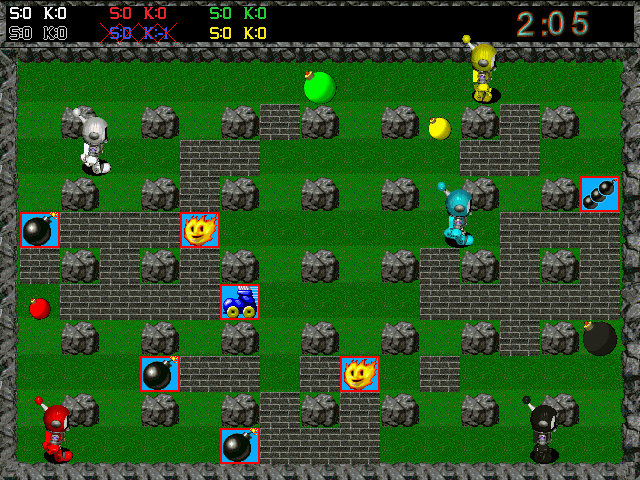 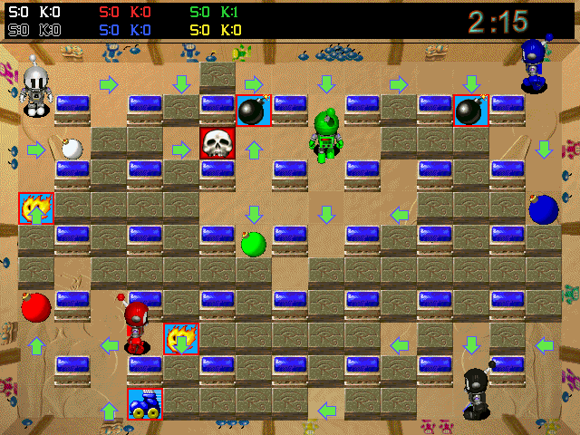

</div>

> **Unofficial fan project.** Not affiliated with Interplay, Hudson Soft or Konami. No original game files are included. It plays out of the box with its own free graphics and sounds; with your own copy of the original you get the original look and sound. See the [disclaimer](#disclaimer).

## 💬 Community

Come and talk about the project, find people to play with, report what breaks and share your arenas: **[join the Discord server](https://discord.gg/NruWuaq56B)**.

## 🔥 What is this?

Atomic Bomberman is a 1997 Windows game. This project does two things:

1. **Reverse engineers it** — the executable, its data formats and its behaviour — and writes down what it does, with the evidence.
2. **Rebuilds it** as a modern C++20 program on SDL3 and OpenGL, whose rules come from that study rather than from translating the old code.

The original is then run side by side (under Wine, driven by scripted key presses) to check that the rules were understood correctly.

## 🎮 What you get

| | |
|---|---|
| 💥 **The real rules** | Movement, corner sliding, bombs, chain reactions, kicks, punches, grab and throw, spooge lines, trigger and jelly bombs, goldflame, duds, nine diseases, 13 powerups |
| 🗺️ **All 11 levels** | With their arrows, conveyor belts, warp holes and trampolines, and every original scheme |
| 🤖 **Computer players** | Modelled on the original's own behaviour list |
| 👥 **Up to 10 players** | Two on the keyboard, gamepads, the rest AI; free-for-all or team play |
| 🌐 **Network play** | A new client-server mode over TCP/UDP: host from the menu or run the dedicated server; lobby, chat, LAN search |
| ⏱️ **The endgame** | Round clock, "hurry", closing walls, draws, match victories |
| 🆓 **Playable without the original** | A free set of graphics, sounds, music and arenas, made by the program's own code |
| 🎨 **Original look and sound** | Graphics, HUD fonts, sound effects and music loaded from your own copy of the game, if you have one |
| 🧪 **Tested** | Automated tests of the game rules run on every push (67 tests at the time of writing); 33 mechanics confirmed against the running original |

## 📸 Screenshots

<div align="center">

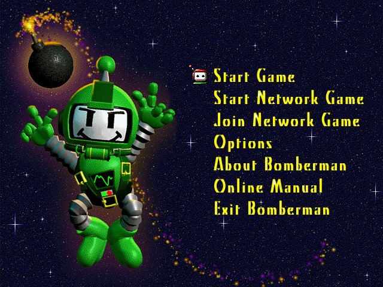 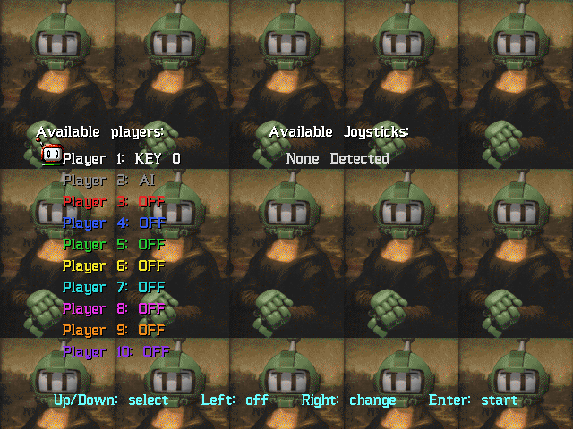 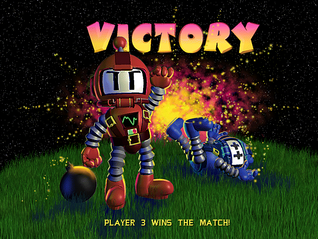

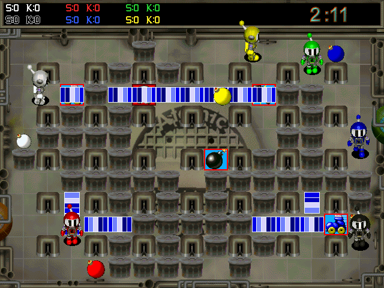 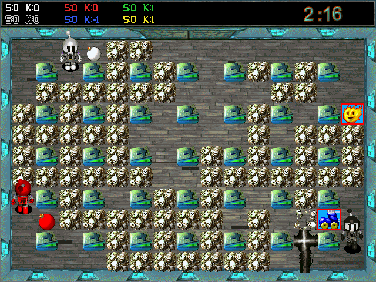 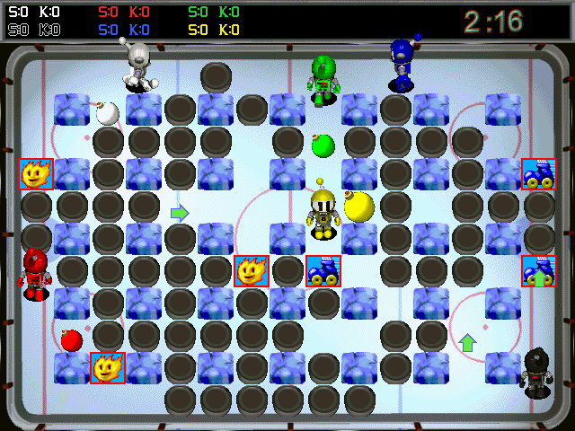

</div>

Without the original game the program uses its own free set (robots instead of the original characters, synthesised sound):

<div align="center">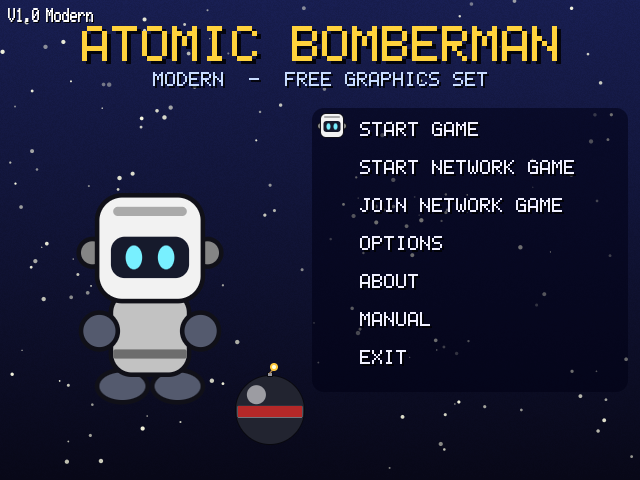 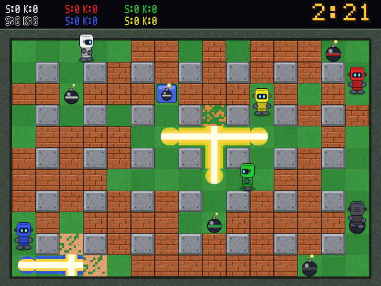</div>

## 🚀 Quick start

1. **Get a build** from the [Actions artifacts or a release](INSTALL.md#1-get-the-program), or build it yourself (below).
2. **Play:**
   ```sh
   ./atomic
   ```
   That is all: with no original game on the machine it starts with the free asset set.
3. **Optional, if you own the original game** (installed or on CD): import its data once for the original graphics, sounds, music and all its arenas.
   ```sh
   ./atomic --import-assets /path/to/original/game
   ```
   `--free` switches back to the free set at any time.

Full instructions, folder locations and troubleshooting: **[INSTALL.md](INSTALL.md)**.

## 📱 Android

There is an Android build (an APK among the downloads): the same game with on-screen controls. It plays with the free asset set, or with the original game's data if you put your copy of the game on the device and choose its folder when the app asks on its first start (it converts it by itself, remembers the folder, and converts again with each new release). It is new and was built and checked on an emulator. How it works, how to build it and what it cannot do yet: [`android/README.md`](android/README.md).

## 🛠️ Build from source

```sh
cmake -S . -B build -DCMAKE_BUILD_TYPE=Release -DAB_FETCH_SDL3=ON
cmake --build build --config Release
ctest --test-dir build -C Release --output-on-failure
```

Needs CMake 3.20+ and a C++20 compiler. `-DAB_FETCH_SDL3=ON` downloads SDL3 and links it in; leave it out to use an installed SDL3 (`libsdl3-dev`). Without SDL3 only the game core and the tests are built. Linux and Windows packages are built by [`.github/workflows/build.yml`](.github/workflows/build.yml).

## 🕹️ Running and controls

```sh
./build/atomic
```

The program looks for the original game's data in: `--game-dir PATH`, the `ATOMIC_GAME_DIR` environment variable, an imported `assets` folder (next to the executable, in the current folder, or in the per-user data folder), or a `game` folder with a copy of the original. The terminal prints `INFO  Game files: …` with what it uses. If none of these holds the original, it plays with the free asset set, which it writes to the per-user data folder on first start ([how it is made](docs/migration/free-assets.md)).

The program opens on the main menu. Choose **Start Game**, set up the player list (Up/Down select a slot, Right cycles AI → KEY 0 → KEY 1 → OFF, Left switches a slot off), press Enter, then choose level, scheme and wins (Left/Right) and press Enter to play. By default player 1 uses the first key set and player 2 is a computer player, as in the original. Options, About Bomberman, Online Manual and Exit work as well; **Start Network Game** and **Join Network Game** open the network mode described below. F1 opens the help pages from any screen. As in the original there are two hidden features: press **Ctrl-E six times** on the main menu for the level (scheme) editor, and **C five times** on the player list for campaign mode. Schemes made with the editor are saved in a `schemes` folder next to your saved settings (Linux: `~/.local/share/atomic-bomberman-modern/atomic/schemes`) and appear in the scheme list.

| | Move | Bomb | Action |
|---|---|---|---|
| KEY 0 | arrow keys | Space | Enter |
| KEY 1 | R (up) D (left) F (down) G (right) | S | A |

**Options → Sound Test** lists every sound file of the game data and plays the one you choose (Tab switches between all, the ones the game never plays, and the ones it uses). The original's disc holds about a thousand sounds the game never plays; they are imported only if you ask: `atomic --import-assets PATH --all-sounds` (about 180 MB more).

These are the original's default keys. Change them under **Options → Define keyboard layouts**.

Connected gamepads appear in the player list as `JOY n` (left stick or d-pad to move, A / cross to bomb, B or X / circle or square for the action). Gamepad support is untested: no controller was available.

The action button punches the bomb ahead (punch), stops your kicked bombs (kicker) and detonates trigger bombs. Pressing the bomb button while standing on your own bomb picks it up (grab; release to throw) or lays a line (spooge).

In a match: `Esc` or `Ctrl-Q` returns to the menu, `R` restarts the round, `P` pauses, `N` advances one step while paused, `F1` opens the help pages. The result screen waits for `Enter` or `Space` (it goes on by itself after six seconds when only computer players are in the game, or after `Alt-W`); the first player to reach the wins target takes the match. With `--debug` (or the environment variable `KWD=1`, as in the original) three of the original's debug keys work in a match: `Ctrl-A` lists the animation sequences, `Alt-D` shows an information window, `F10` clears a campaign stage.

Options: `--scheme NAME` (file in `data/schemes`, default `basic`), `--level N` (0-10: graphics, music and extras), `--wins N` (default 2), `--players N --humans H` (preset the player list; `--humans 0` or `--demo` is all computer players), `--start` (skip the menu), `--campaign NAME` (play a campaign file: `simple`, `ghosts`, `crouton`), `--no-intro` (skip the intro movie, the logo and the title screens), `--roulette` (bonus-game wheel for the winner of a match, before the next match), `--connect ADDRESS` (join a network game at once), `--host [PORT]` (host one at once), `--seed N`, `--mute`, `--free` (the free asset set even when the original is installed), `--shapes`, `--native` (640×480 window), `--frames N --screenshot out.ppm` (automated capture), `--result-shot` (capture the first result screen), `--script up,down,left,right,enter,esc` (scripted menu keys, one every 10 frames).

## 🌐 Network play

This is a **new** network mode, not the original's (which used IPX and serial links). One server runs the game; everybody else connects to it. Up to ten players, up to four at one computer; free seats can be filled with computer players. The design is in [`docs/specifications/networking.md`](docs/specifications/networking.md).

<div align="center">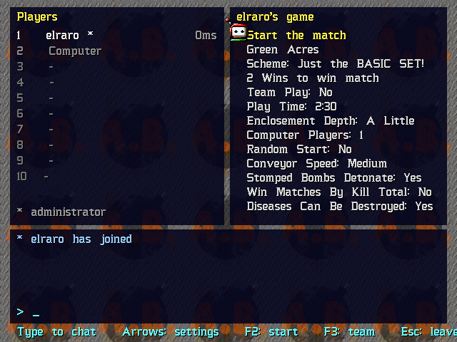</div>

**Host from the game.** Main menu → **Start Network Game**: set your name, a name for the game, the port (default 27410) and optionally a password, then *Start the server*. You land in the lobby as its administrator.

**Join.** Main menu → **Join Network Game**: games on your local network are listed; for any other, type the host's address (`host` or `host:port`) and press Enter. Or start the game with `--connect ADDRESS`.

**Lobby.** Seats and ping times on the left, the match settings on the right, the chat below. Just type to chat. The administrator (marked `*`, the player who has been there longest) changes the settings with the arrow keys and starts with `F2` or Enter on *Start the match*; `/kick NAME` or `/ban NAME` in the chat removes a player. `F3` changes your team. `F5` adds another player at your computer (the second uses the second key set; each can use a gamepad), `F6` removes one, `F4` changes the second one's team. The settings include the roulette ("Gold Bomberman": everybody watches the wheel before the match) and a **campaign** to play together against rovers and ghosts. `Esc` twice leaves.

**In the match** you play with the first key set (arrows, Space, Enter by default) or the first gamepad. `T` opens the chat line. `Esc` twice (or `Ctrl-Q` twice) takes you back to the lobby: you stay on the server, a computer player takes over your seat until the match ends, and you are in the next one; `Esc` twice in the lobby leaves the server. Whoever connects during a match watches it and gets a seat when it ends.

**Dedicated server.** `atomic_server` is the same server without a window; it needs no graphics and no SDL:

```sh
./atomic_server --name "Friday bombs" --port 27410 --game-dir /path/to/assets --computers 2
```

It reads schemes, tuning values and level extras from the same game data as the game (`--game-dir`, `ATOMIC_GAME_DIR`, an `assets` folder, or the per-user folder), and logs joins, chat and results. Type `status`, `say TEXT` or `quit` on its console; `--help` lists the options (`--password`, `--level`, `--wins`, `--play-time`, `--team-play`, `--hidden`, ...). The first player to join is the administrator.

**Reaching a server.** The host's port must be reachable for **TCP and UDP**. A game hosted from the menu asks the router to open the port by itself (UPnP) and says in the lobby whether that worked and which address to give your friends; `atomic_server --upnp` does the same. If the router does not cooperate, forward the port by hand, or use a **relay**: someone runs `atomic_server --relay-server` on a machine everybody can reach, the host names it in the *Relay* field (or `atomic_server --relay ADDRESS`), and the others join with the code the lobby shows, as `CODE@relay-address`. Servers on your local network are found on any port. IPv6 addresses work too (`[address]:port`). If only TCP gets through the game still works, a little less smoothly. Players need the same version of the program; they do not need the same schemes, because the server sends the arena.

**Privacy and bad behaviour.** Connections are encrypted (the chat, the names and the password cannot be read or altered on the way), and the password itself is never sent. Each server has an identity your game remembers: if the server at an address is later a different one, you are warned instead of connected. What lies under the bricks and what chance will decide next are kept on the server, so a tampered game cannot peek. The administrator can hand the role over (`/admin NAME`), `/kick NAME` (out for five minutes) or `/ban NAME` (out until `/unban ADDRESS`); the dedicated server's console has `kick`, `ban`, `unban` and `bans`. The server also limits connections, password guesses and message floods per address. This protects a game among people who mostly trust each other; it is home-made cryptography that passes the standard test vectors, not an audited security product, and a ban follows an address, not a person.

**What to expect.** Your own moves are shown at once (client-side prediction) and confirmed by the server a moment later; other players are shown where the server last confirmed them, so on a slow link they are a moment behind. The sounds of your own actions are immediate too; explosions and other players are heard with the link's delay. **Options → Network: Show Own Moves At Once** switches prediction on and off (it applies to the next game you join). This mode has been tested on one machine at a time only: automated tests over the loopback interface on Linux and Windows, including with 40 % packet loss, and matches against a dedicated server with scripted clients on Linux. It has not yet been played between two real computers, and the router port opening was tested against a simulated router only.

## 🔬 How it was made

| Step | Where |
|---|---|
| Inventory of the original, executable analysis, Ghidra work | [`docs/reverse-engineering/`](docs/reverse-engineering/) — start with [`JOURNAL.md`](docs/reverse-engineering/JOURNAL.md) |
| What the game does, independent of the old code | [`docs/specifications/`](docs/specifications/) |
| Experiments on the running original | [`dynamic-analysis.md`](docs/reverse-engineering/dynamic-analysis.md) |
| What is confirmed, tested, or neither | [`validation-status.md`](docs/testing/validation-status.md) |
| How the modern program is put together | [`docs/migration/`](docs/migration/) |
| Open questions | [`unknowns.md`](docs/reverse-engineering/unknowns.md) |

A few things learned along the way:

- The bomb fuse is exactly 2.000 s on the original, measured on 84 bombs.
- The original has no frame limiter; on a modern machine it runs about 960 frames per second, which quietly changes the rules that count frames instead of time.
- Chain reactions are not instant: each link costs one frame.
- A dying player still counts as alive for one second, which is how draws happen.
- The main menu's lettering is part of the background picture; the game only draws the cursor.

## 📂 Repository layout

| Path | Contents |
|---|---|
| `src/game/` | Gameplay core and computer players. Deterministic, no platform dependencies |
| `src/app/`, `src/rendering/`, `src/audio/` | SDL3 window and input, OpenGL 3.3 renderer, sound and music |
| `src/resources/` | Readers for the original's file formats, and the asset importer |
| `android/` | The Android app: Gradle project and manifest around the same C++ code |
| `src/free/` | The free asset set: graphics, sounds, music and arenas made by code |
| `src/net/`, `src/server/` | Network mode: sockets, protocol, server, client; the dedicated server program |
| `tests/unit/` | Tests that encode the specified rules |
| `tools/asset-extractor/` | Python reader and extractor for `.ani` sprite files |
| `tools/diagnostics/` | Scripts that run, drive and measure the original under Wine |
| `docs/` | Reverse-engineering notes, specifications, test matrix |
| `AGENTS.md` | The rules this project is worked under |

## 🚧 Status

Playable: local matches against computer players or a second person, on every level; network matches through a hosted or dedicated server.

Not there yet:

- Nobody has play-tested it thoroughly; expect rough edges.
- The free asset set's sounds, music and synthetic robot voices are generated by formula and have not been listened to; its animations were only checked as still frames.
- The Windows build and the GitHub Actions workflow are new and may need fixes.
- Network play is a new client-server mode (see above). Its automated tests pass on Linux and Windows (GitHub Actions) and scripted matches ran on one Linux machine; it has not been played between two real computers, and the Windows game window has not been started in this mode.
- About 30 scenarios of the test matrix have not been observed on the original yet (mostly random ones: diseases, duds, powerup placement).
- The computer players' behaviours and searches follow the original's code as read; their playing strength has not been compared with the original running.

## Disclaimer

This is an unofficial, non-commercial fan project. It is **not affiliated with, endorsed by, sponsored by or connected to** Interplay Entertainment / Interplay Productions, Hudson Soft, Konami (which absorbed Hudson Soft in 2012), or any other company or person that holds or may hold rights in Atomic Bomberman or Bomberman.

"Atomic Bomberman" and "Bomberman" are trademarks of their respective owners and are used here only to describe what this software is compatible with. The original game, its artwork, sounds, music, level data and documentation remain the property of their respective copyright holders.

This repository and the packages built from it contain **no** original game code or asset files. The screenshots in this README show the modern program running with graphics loaded from a legitimately owned copy of the original game; they are included only to illustrate what the software does. To use the original graphics and sounds you must supply them from a copy of the game that you own; see [INSTALL.md](INSTALL.md). Do not redistribute the original files or anything produced from them.

If you hold rights in the original game and have a concern about this project, please open an issue on the repository.

## License

Copyright (C) 2026 the authors of this project.

The source code, tools and documentation in this repository are free software: you can redistribute them and/or modify them under the terms of the **GNU General Public License** as published by the Free Software Foundation, either **version 3** of the License, or (at your option) any later version. They are distributed in the hope that they will be useful, but WITHOUT ANY WARRANTY; without even the implied warranty of MERCHANTABILITY or FITNESS FOR A PARTICULAR PURPOSE. See [LICENSE](LICENSE) for the full text.

The license covers only the new material in this repository. It grants no rights in the original game or its assets.

The release packages include SDL3, which is under the zlib license.

