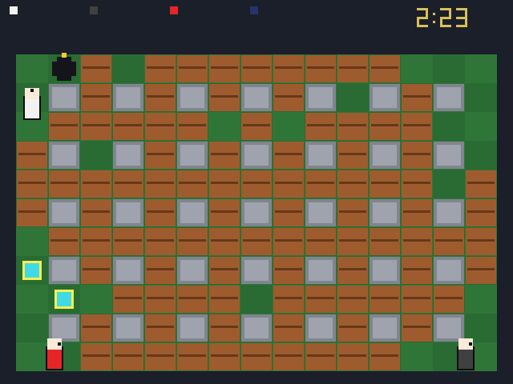

<div align="center">

# 💣 Atomic Bomberman — Modern

**A clean, from-scratch reimplementation of Atomic Bomberman (1997), rebuilt by reverse engineering the original and checking every rule against it.**

[](https://github.com/elraro/atomic-bomberman/actions/workflows/build.yml)


 

</div>

> **Unofficial fan project.** Not affiliated with Interplay, Hudson Soft or Konami. No original game files are included: you bring your own copy. See the [disclaimer](#disclaimer).

## 🔥 What is this?

Atomic Bomberman is a 1997 Windows game. This project does two things:

1. **Reverse engineers it** — the executable, its data formats and its behaviour — and writes down what it does, with the evidence.
2. **Rebuilds it** as a modern C++20 program on SDL3 and OpenGL, whose rules come from that study rather than from translating the old code.

The original is then run side by side (under Wine, driven by scripted key presses) to check that the rules were understood correctly.

## 🎮 What you get

| | |
|---|---|
| 💥 **The real rules** | Movement, corner sliding, bombs, chain reactions, kicks, punches, grab and throw, spooge lines, trigger and jelly bombs, goldflame, duds, nine diseases, 13 powerups |
| 🗺️ **All 11 levels** | With their arrows, conveyor belts, warp holes and trampolines, and every original scheme |
| 🤖 **Computer players** | Modelled on the original's own behaviour list |
| 👥 **Up to 10 players** | Two on the keyboard, gamepads, the rest AI; free-for-all or team play |
| ⏱️ **The endgame** | Round clock, "hurry", closing walls, draws, match victories |
| 🎨 **Original look and sound** | Graphics, HUD fonts, sound effects and music loaded from your own copy of the game |
| 🧪 **Tested** | 50 automated tests; 33 mechanics confirmed against the running original |

## 📸 Screenshots

<div align="center">

  

  

</div>

Without game files the program still runs, drawing everything as plain shapes:

<div align="center"></div>

## 🚀 Quick start

1. **Get a build** from the [Actions artifacts or a release](INSTALL.md#1-get-the-program), or build it yourself (below).
2. **Import the game data** from your own copy of the original, once:
   ```sh
   ./atomic --import-assets /path/to/original/game
   ```
3. **Play:**
   ```sh
   ./atomic
   ```

Full instructions, folder locations and troubleshooting: **[INSTALL.md](INSTALL.md)**.

## 🛠️ Build from source

```sh
cmake -S . -B build -DCMAKE_BUILD_TYPE=Release -DAB_FETCH_SDL3=ON
cmake --build build --config Release
ctest --test-dir build -C Release --output-on-failure
```

Needs CMake 3.20+ and a C++20 compiler. `-DAB_FETCH_SDL3=ON` downloads SDL3 and links it in; leave it out to use an installed SDL3 (`libsdl3-dev`). Without SDL3 only the game core and the tests are built. Linux and Windows packages are built by [`.github/workflows/build.yml`](.github/workflows/build.yml).

## 🕹️ Running and controls

```sh
./build/atomic
```

The program needs the original game's data for the menu, graphics and sound. It looks in: `--game-dir PATH`, the `ATOMIC_GAME_DIR` environment variable, an imported `assets` folder (next to the executable, in the current folder, or in the per-user data folder), or a `game` folder with a copy of the original. The terminal prints `INFO  Game files: …` when it is found; if it is not, the window title says so and the program falls back to placeholder shapes with no menu.

With game files the program opens on the main menu. Choose **Start Game**, set up the player list (Up/Down select a slot, Right cycles AI → KEY 0 → KEY 1 → OFF, Left switches a slot off), press Enter, then choose level, scheme and wins (Left/Right) and press Enter to play. By default player 1 uses the first key set and player 2 is a computer player, as in the original. The other menu items are not implemented.

| | Move | Bomb | Action |
|---|---|---|---|
| KEY 0 | arrow keys | Space or Right Ctrl | Enter or Right Shift |
| KEY 1 | W A S D | Tab or Left Ctrl | Q or Left Shift |

Connected gamepads appear in the player list as `JOY n` (left stick or d-pad to move, A / cross to bomb, B or X / circle or square for the action). Gamepad support is untested: no controller was available.

The action button punches the bomb ahead (punch), stops your kicked bombs (kicker) and detonates trigger bombs. Pressing the bomb button while standing on your own bomb picks it up (grab; release to throw) or lays a line (spooge).

In a match: `Esc` returns to the menu, `R` restarts the round, `P` pauses, `N` advances one step while paused. A decided round restarts after three seconds; the first player to `--wins` rounds takes the match.

Options: `--scheme NAME` (file in `data/schemes`, default `basic`), `--level N` (0-10: graphics, music and extras), `--wins N` (default 2), `--players N --humans H` (preset the player list; `--humans 0` or `--demo` is all computer players), `--start` (skip the menu), `--seed N`, `--mute`, `--shapes`, `--native` (640×480 window), `--frames N --screenshot out.ppm` (automated capture), `--result-shot` (capture the first result screen), `--script up,down,left,right,enter,esc` (scripted menu keys, one every 10 frames).

## 🔬 How it was made

| Step | Where |
|---|---|
| Inventory of the original, executable analysis, Ghidra work | [`docs/reverse-engineering/`](docs/reverse-engineering/) — start with [`JOURNAL.md`](docs/reverse-engineering/JOURNAL.md) |
| What the game does, independent of the old code | [`docs/specifications/`](docs/specifications/) |
| Experiments on the running original | [`dynamic-analysis.md`](docs/reverse-engineering/dynamic-analysis.md) |
| What is confirmed, tested, or neither | [`validation-status.md`](docs/testing/validation-status.md) |
| How the modern program is put together | [`docs/migration/`](docs/migration/) |
| Open questions | [`unknowns.md`](docs/reverse-engineering/unknowns.md) |

A few things learned along the way:

- The bomb fuse is exactly 2.000 s on the original, measured on 84 bombs.
- The original has no frame limiter; on a modern machine it runs about 960 frames per second, which quietly changes the rules that count frames instead of time.
- Chain reactions are not instant: each link costs one frame.
- A dying player still counts as alive for one second, which is how draws happen.
- The main menu's lettering is part of the background picture; the game only draws the cursor.

## 📂 Repository layout

| Path | Contents |
|---|---|
| `src/game/` | Gameplay core and computer players. Deterministic, no platform dependencies |
| `src/app/`, `src/rendering/`, `src/audio/` | SDL3 window and input, OpenGL 3.3 renderer, sound and music |
| `src/resources/` | Readers for the original's file formats, and the asset importer |
| `tests/unit/` | Tests that encode the specified rules |
| `tools/asset-extractor/` | Python reader and extractor for `.ani` sprite files |
| `tools/diagnostics/` | Scripts that run, drive and measure the original under Wine |
| `docs/` | Reverse-engineering notes, specifications, test matrix |
| `AGENTS.md` | The rules this project is worked under |

## 🚧 Status

Playable: local matches against computer players or a second person, on every level.

Not there yet:

- Nobody has play-tested it thoroughly; expect rough edges.
- The Windows build and the GitHub Actions workflow are new and may need fixes.
- Options, manual and network menu items do nothing. Network play and campaign mode are not implemented.
- About 30 scenarios of the test matrix have not been observed on the original yet (mostly random ones: diseases, duds, powerup placement).
- The computer players follow the original's structure, but two of its search routines were approximated.

## Disclaimer

This is an unofficial, non-commercial fan project. It is **not affiliated with, endorsed by, sponsored by or connected to** Interplay Entertainment / Interplay Productions, Hudson Soft, Konami (which absorbed Hudson Soft in 2012), or any other company or person that holds or may hold rights in Atomic Bomberman or Bomberman.

"Atomic Bomberman" and "Bomberman" are trademarks of their respective owners and are used here only to describe what this software is compatible with. The original game, its artwork, sounds, music, level data and documentation remain the property of their respective copyright holders.

This repository and the packages built from it contain **no** original game code or asset files. The screenshots in this README show the modern program running with graphics loaded from a legitimately owned copy of the original game; they are included only to illustrate what the software does. To use the original graphics and sounds you must supply them from a copy of the game that you own; see [INSTALL.md](INSTALL.md). Do not redistribute the original files or anything produced from them.

If you hold rights in the original game and have a concern about this project, please open an issue on the repository.

## License

Copyright (C) 2026 the authors of this project.

The source code, tools and documentation in this repository are free software: you can redistribute them and/or modify them under the terms of the **GNU General Public License** as published by the Free Software Foundation, either **version 3** of the License, or (at your option) any later version. They are distributed in the hope that they will be useful, but WITHOUT ANY WARRANTY; without even the implied warranty of MERCHANTABILITY or FITNESS FOR A PARTICULAR PURPOSE. See [LICENSE](LICENSE) for the full text.

The license covers only the new material in this repository. It grants no rights in the original game or its assets.

The release packages include SDL3, which is under the zlib license.

